<div align="center">

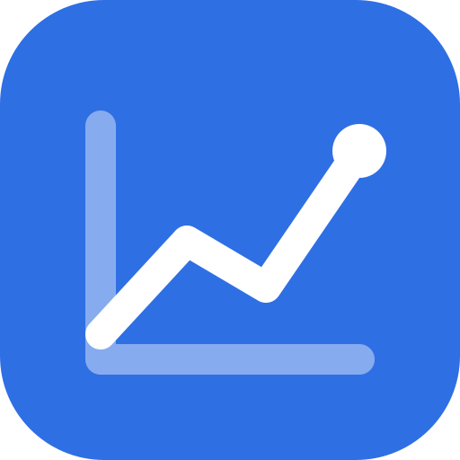

# chart-forge

**Charts that make the point, not just plot the numbers.** Hand an agent a table, a CSV or a query
result: it decides what the chart has to say, picks the form that says it fastest, and renders a
self-contained interactive page — validated colours, hover readouts, a table view and dark mode.

[](LICENSE)
[](#install)
[](#install)

<a href="https://ko-fi.com/J3J3YMOKZ"></a>

</div>

<picture>
  <source media="(prefers-color-scheme: dark)" srcset="assets/gallery/hero-dark.png?v=0.2.1">
  
</picture>
<p align="center"><sub>Every image in this README was rendered by the skill from the specs in <code>assets/examples/</code>, light and dark from the same file.</sub></p>

`chart-forge` is an [Agent Skill](https://agentskills.io). The palette is validated for colour-vision
deficiency and contrast before it ships, and the title is a sentence, not a metric name.

> **中文速览** — 让 agent 基于数据画出「合适、好看、可交互」的图表。你给数据，它先想清楚这张图要说什么，
> 再选图型、写一份 JSON 规格，渲染成零依赖的交互式 HTML（可导出 PNG）：悬停读数、表格视图、深色模式都自带，
> 配色经过色盲与对比度校验，标题写结论而不是指标名。界面语言按图表内容自动切换中/英。
> 安装：`npx skills add zluckyhou/chart-forge`。详见 [README.zh-CN.md](README.zh-CN.md)。

## Install

```bash
npx skills add zluckyhou/chart-forge      # Claude Code, Codex, Cursor …
```

Or clone it into wherever your agent reads skills from:

```bash
git clone https://github.com/zluckyhou/chart-forge ~/.claude/skills/chart-forge
```

Rendering HTML needs Python 3 and nothing else. PNG export additionally needs
`pip install playwright && playwright install chromium`.

## How it works

A chart is a JSON file. This is the whole spec behind the first chart above:

```json
{
  "type": "line",
  "title": "Subscriptions passed one-off sales in January",
  "subtitle": "Monthly revenue by sales model · Jul 2024 – Jun 2026 · $ thousands · sample data",
  "source": "Chart Forge sample · billing export",
  "data": {
    "x": ["2024-07", "2024-08", "…", "2026-06"],
    "series": [
      { "name": "Subscriptions", "values": [118, 124, "…", 412] },
      { "name": "One-off sales", "values": [262, 258, "…", 294] }
    ]
  },
  "options": {
    "format": "currency", "currency": "$",
    "annotations": [{ "x": "2025-04", "label": "Annual plan launched" }]
  }
}
```

```bash
python3 scripts/render.py chart.json --validate            # types, lengths, funnel monotonicity, OHLC ordering…
python3 scripts/render.py chart.json -o out/chart.html     # one self-contained file
python3 scripts/render.py chart.json -o out/chart.html --png --theme dark
python3 scripts/render.py a.json b.json -o out/report.html # several charts, one page
python3 scripts/render.py chart.json -o out/chart.html --register publish --png   # for slides and posts: toolbar only on hover, never in the PNG
```

The division of labour is the point: **the agent owns the message, the skill owns the craft.** The
agent writes the conclusion, chooses the form and decides what to emphasise; axis rounding, label
collisions, hit areas, hover layers, the table twin, the dark palette and the export are already
handled, identically in every chart.

## The eleven forms

Ten `type` values (ranking is `bar` with `horizontal: true`), each with a runnable spec in
[`assets/examples/`](assets/examples).

| | |
|---|---|
| **Line / area** — end labels carry the series name and its latest value and stand in for the legend; the lead series gets a dot per period; annotations explain the turn in small caps; monotone smoothing never overshoots the data. <br><br><picture><source media="(prefers-color-scheme: dark)" srcset="assets/gallery/line-crossover-dark.png">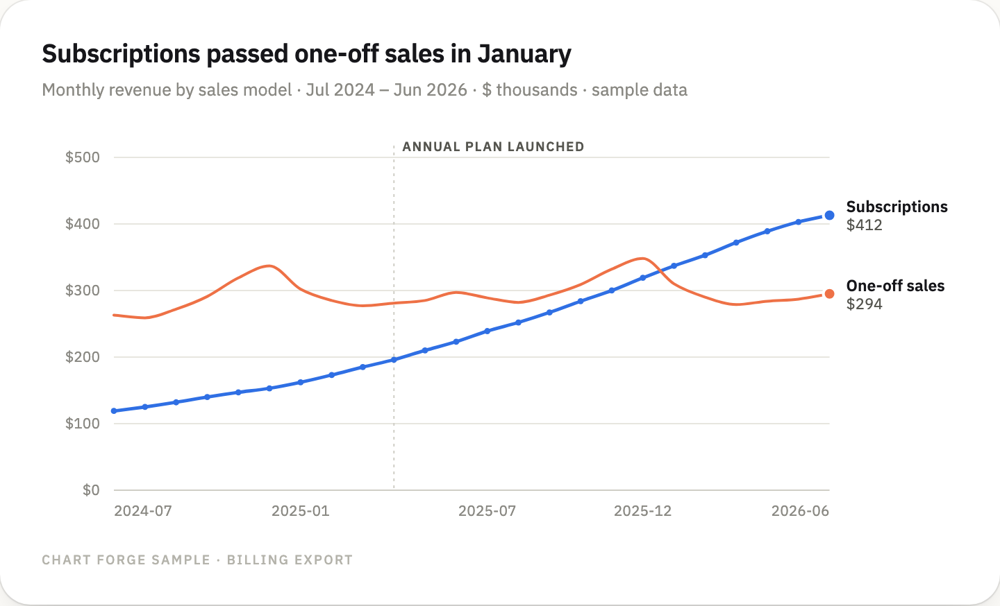</picture> | **Ranking** — sorted (the order is the rank), one highlighted subject with the rest greyed, and a dashed average line running through the bars. Hover swaps the value for share and distance from the average. <br><br><picture><source media="(prefers-color-scheme: dark)" srcset="assets/gallery/bar-ranking-dark.png">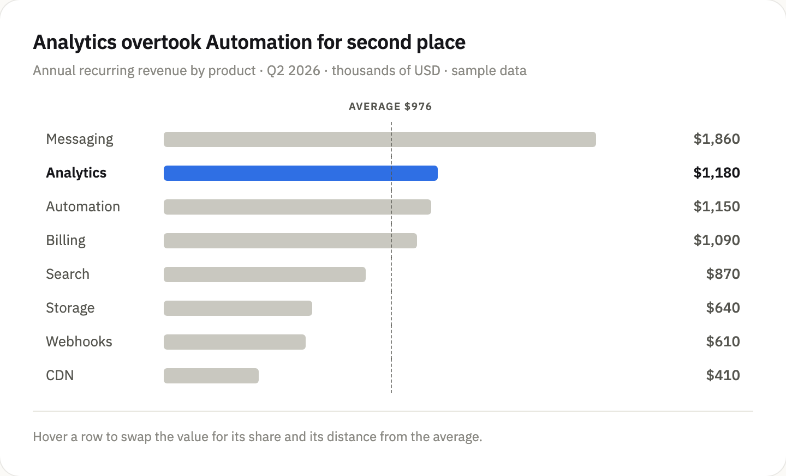</picture> |
| **Bar** — grouped or stacked from the same spec; hovering lights the whole category band and reads out every series; the latest period is direct-labelled. <br><br><picture><source media="(prefers-color-scheme: dark)" srcset="assets/gallery/bar-grouped-dark.png">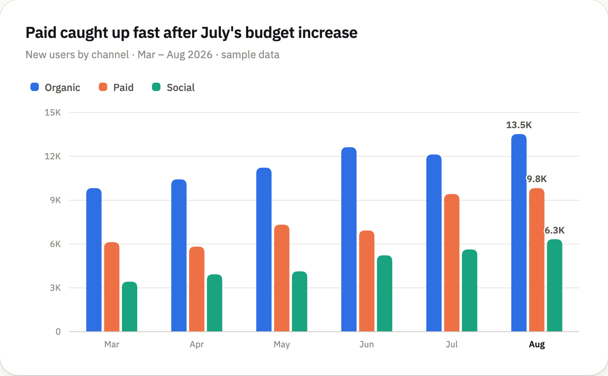</picture> | **Funnel** — the neck between two steps *is* the drop-off, with the step conversion printed inside it and the worst step badged automatically. <br><br><picture><source media="(prefers-color-scheme: dark)" srcset="assets/gallery/funnel-checkout-dark.png">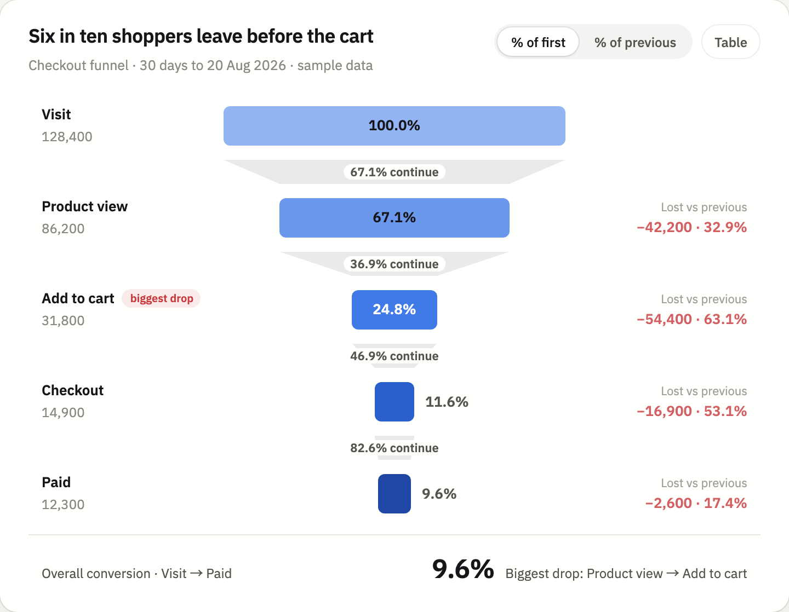</picture> |
| **Heatmap** — one hue light to dark, with row and column marginal bars so the busiest day and hour read at a glance; a diverging scale for signed data. <br><br><picture><source media="(prefers-color-scheme: dark)" srcset="assets/gallery/heatmap-hours-dark.png">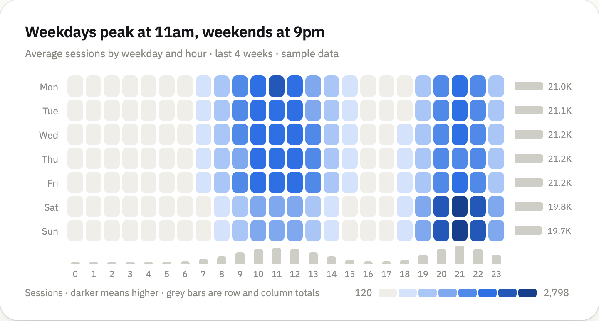</picture> | **Scatter** — hovering drops guides to both axes with value chips; the top points label themselves and skip the label when it would overlap; medians split the plot into quadrants. <br><br><picture><source media="(prefers-color-scheme: dark)" srcset="assets/gallery/scatter-roi-dark.png">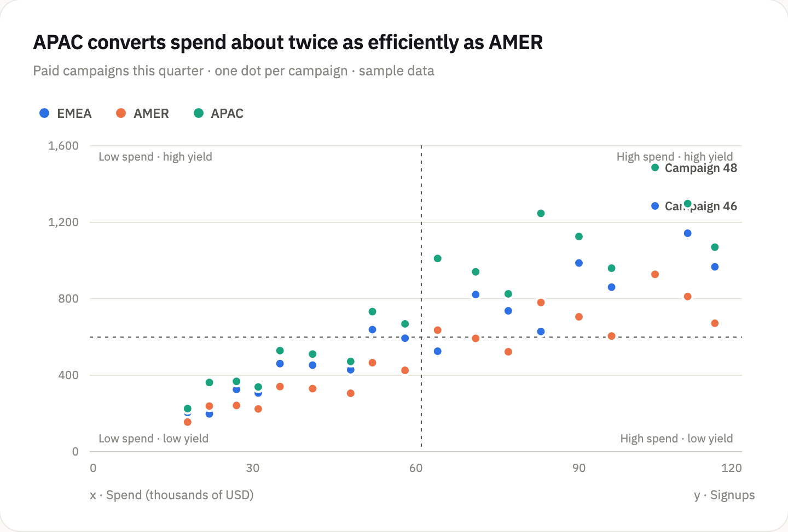</picture> |
| **Donut** — legend rows carry a share line in the slice's own colour and the centre readout follows the pointer; one click switches to bars when the shares are too close to compare as arcs. <br><br><picture><source media="(prefers-color-scheme: dark)" srcset="assets/gallery/donut-share-dark.png">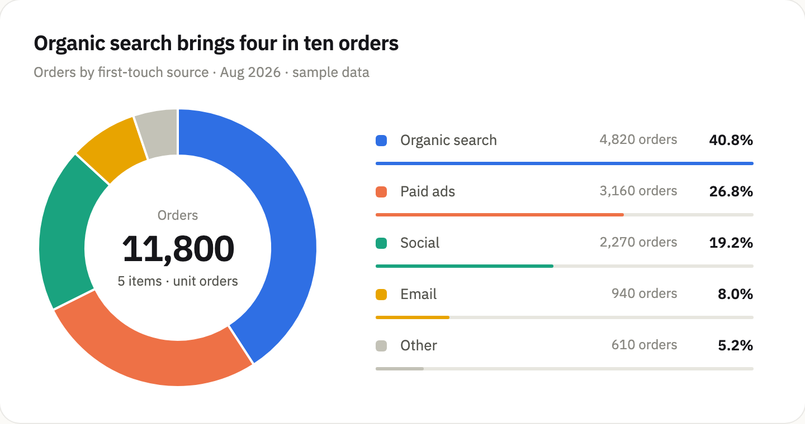</picture> | **Table** — sticky header and first column, in-cell bars that can share one scale across columns, tags, two-level headers, click-to-sort. <br><br><picture><source media="(prefers-color-scheme: dark)" srcset="assets/gallery/table-experiment-dark.png">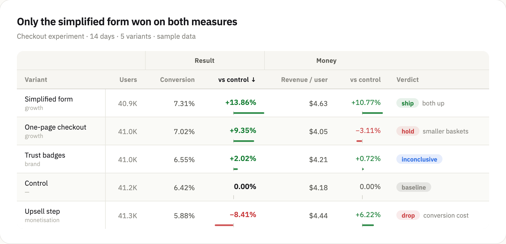</picture> |
| **Candlestick** — OHLC with a trading-app tooltip and an axis that frames the range instead of anchoring at zero. Red-up by default, `colors: "intl"` flips it. <br><br><picture><source media="(prefers-color-scheme: dark)" srcset="assets/gallery/candle-price-dark.png">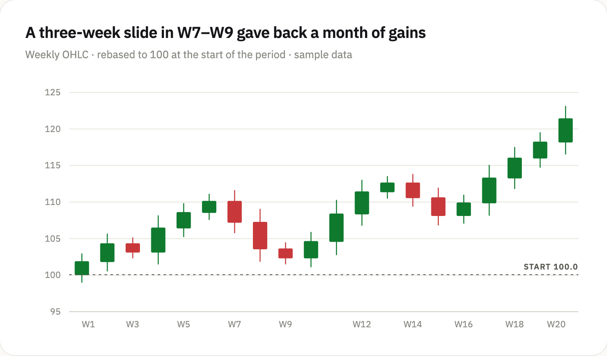</picture> | **KPI tiles** — value, a signed pill that knows whether up is good, and a sparkline tinted by that judgement. <br><br><picture><source media="(prefers-color-scheme: dark)" srcset="assets/gallery/kpi-tiles-dark.png">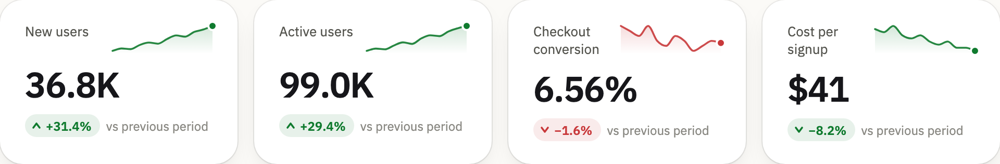</picture> |

## Why they read faster than a default chart

- **The title is the finding.** "Analytics overtook Automation for second place" — not "ARR by product".
  The metric name, period, unit and provenance go on one subtitle line. Two lines of header, never three.
- **Emphasis is a first-class option.** `highlight` promotes one entity and greys the rest, so a chart
  makes one point instead of offering eight colours and no argument.
- **Direct labels beat lookups.** Line ends, peaks, the latest period and the top scatter points label
  themselves; everything else stays in the tooltip and the table view.
- **Colour follows the entity, never its rank.** Hiding a series never repaints the survivors.
- **No second y-axis, ever.** Two measures of different magnitude get two charts or a common index.
- **Every chart has a table twin.** Hover enhances, it never gates: values stay reachable by keyboard,
  and by readers who cannot use hover at all.
- **Editorial, not dashboard.** A rounded card with a hairline edge and no shadow on a warm plane, a
  quiet toolbar (hidden until hover in the `publish` register), small-caps annotations and an optional
  `source` line, and one entrance — bars rise, lines draw, slices fade in — after which the chart is
  still. The palette and the forms are the same in both registers; only the chrome changes.

The full list of rules the output is held to — and the anti-patterns that fail review — is in
[`references/rules.md`](references/rules.md); the "which form?" decision table is in
[`references/choosing-a-form.md`](references/choosing-a-form.md); the spec is documented field by
field in [`references/spec.md`](references/spec.md).

## Colour is computed, not eyeballed

The palette in [`assets/palette.json`](assets/palette.json) ships with the receipts. Eight categorical
hues, a sequential ramp, a six-step ordinal ramp and a diverging pair, each specified twice — once for
the light surface, once for the dark one — and each checked by a script rather than by taste:

```bash
python3 scripts/validate_palette.py --from-json assets/palette.json
```

```
Palette (light, surface #fffffe, categorical): 8 slots
  [PASS] Lightness band         all 8 inside L 0.43–0.77
  [PASS] Chroma floor           all 8 >= 0.10
  [PASS] CVD separation         worst adjacent #1aa37f↔#ee7146 ΔE 8.1 (protan) · tritan 6.8
  [PASS] Normal-vision floor    worst adjacent #e57aa6↔#e8a400 ΔE 20.7 (normal)
  [WARN] Contrast vs surface    below 3:1 — ship direct labels or the table view: […]
```

Adjacent hues are simulated for protanopia, deuteranopia and tritanopia and measured in OKLab; the
slot **order** is the safety mechanism, so re-skinning to a brand means editing the tokens, mirroring
them into the CSS, and re-running the validator until light and dark both pass.

## Language and theme

Chart chrome — buttons, table headers, tooltip labels, scale notes — follows the language of the
spec's own text: any CJK anywhere and it renders in Chinese, otherwise English. Override with
`"lang": "zh" | "en"`. Titles, series names and categories are always printed exactly as written.

The rendered page follows the reader's system theme and carries a toggle; `--theme light|dark` pins it
for an export. Both palettes are validated separately against their own surface — dark mode is a
selected set of steps, not an inverted one.

## Repository layout

```
SKILL.md                     the contract the agent follows
references/choosing-a-form.md  which form, and when not to draw a chart at all
references/spec.md             every field of every chart type
references/rules.md            the design rules and the anti-pattern list
assets/chartkit.js             the renderer: SVG marks, interaction, table view, i18n   (no dependencies)
assets/chartkit.css            design tokens and chart chrome, light and dark
assets/palette.json            the colour tokens, with the validation they passed
assets/templates/page.html     the standalone page shell
assets/examples/*.json         one runnable spec per form
assets/gallery/*.png           the images in this README, rendered from those specs
scripts/render.py              spec → HTML (+ PNG via Playwright), and --validate      (stdlib)
scripts/validate_palette.py    the six colour checks, light and dark                    (stdlib)
```

## Scope and limits

- It renders **one chart per spec**, deliberately. Dashboards, filter bars and cross-chart linking are
  out of scope — compose several charts on a page instead.
- Not a general plotting engine. If you need maps, sankeys, network graphs or 3D, use
  [ECharts](https://echarts.apache.org) or [D3](https://d3js.org); this covers the forms that
  analysis reports actually use, and covers them properly.
- Data goes in the spec, so it is not a live-data component: re-render when the numbers change.
- PNG export needs a headless Chromium; HTML export needs nothing.
- The web font comes from Google Fonts unless you pass `--no-webfont`.

## Star history

The chart is generated inside this repository by
[Star History Action](https://github.com/narayann7/star-history-action). It uses the
repository-scoped `GITHUB_TOKEN`, so it keeps working when third-party chart services lose access to
GitHub's star data.

<!-- star-history:start -->
<picture>
  <source media="(prefers-color-scheme: dark)" srcset="docs/star-history/star-history-dark.svg">
  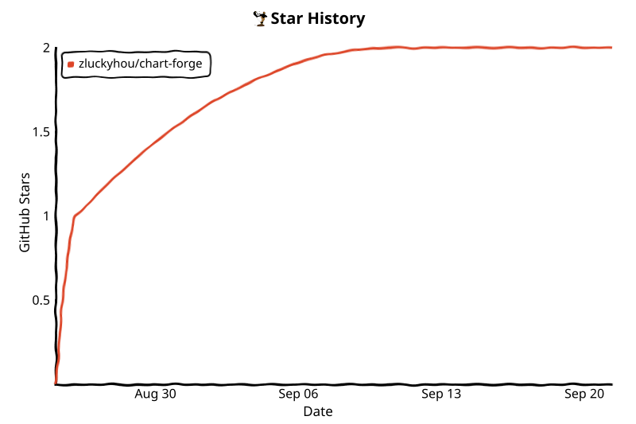
</picture>
<!-- star-history:end -->

## License

[MIT](LICENSE) — use it anywhere, including commercially.
