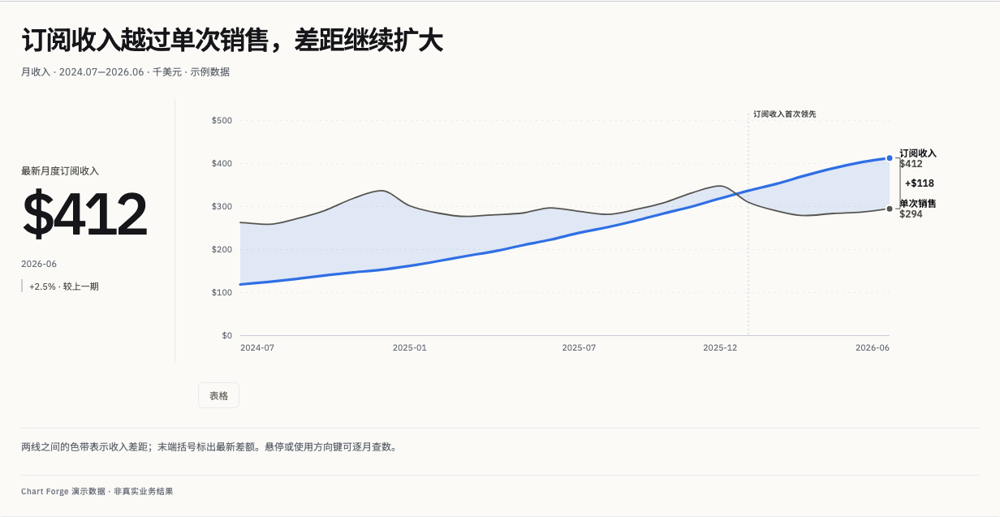
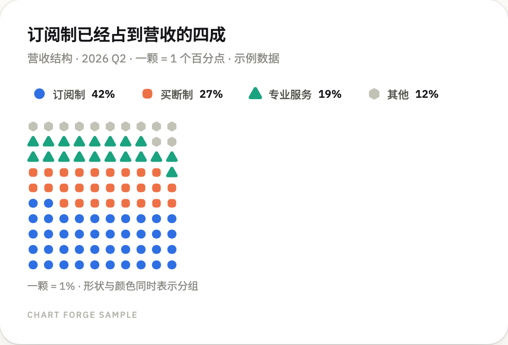
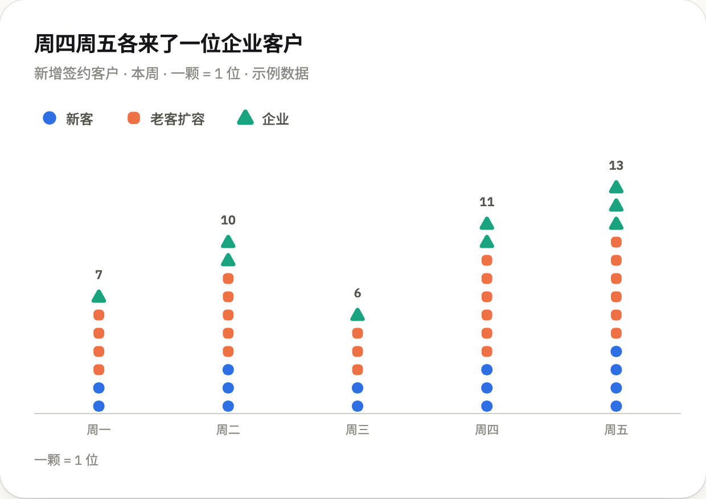
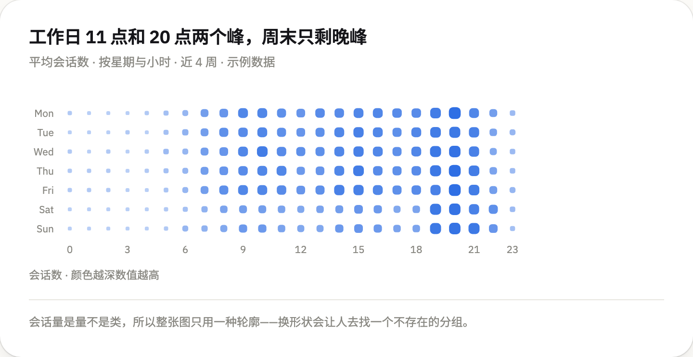
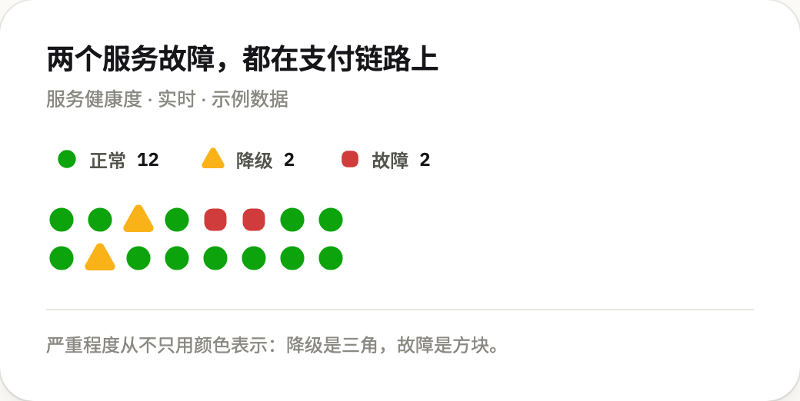

<div align="center">


# chart-forge

**让图表说出结论，而不只是把数字画出来。** 把一张表、一份 CSV 或一段查询结果交给 agent：
它先想清楚这张图要说什么，再选出最快能证明这句话的图型，渲染成自包含的交互页面——
校验过的配色、悬停读数、表格视图、深色模式。

[](LICENSE)
[](#安装)
[](#安装)

<a href="https://ko-fi.com/J3J3YMOKZ"></a>

</div>

> **默认样式已升级为 Studio / Signal。** 开放式版面、数值排名条、数据关键数侧栏（`layout: feature`）和可选的双线差距色带。运行 `python3 scripts/design_preview.py preview.html` 查看当前交互设计。下方首图展示当前设计；后面的各图型图片保留上一个 **Classic** 版本，可用 `--style classic` 切换。

<picture>
  <source media="(prefers-color-scheme: dark)" srcset="assets/gallery/studio-signal-dark.png">
  
</picture>
<p align="center"><sub>README 里每张图都由本 skill 从 <code>assets/examples/</code> 的规格渲染而来，浅色与深色出自同一个文件。</sub></p>

`chart-forge` 是一个 [Agent Skill](https://agentskills.io)。配色在发布前经过色盲与对比度校验，
标题写的是结论，不是指标名。

## 安装

```bash
npx skills add zluckyhou/chart-forge      # Claude Code、Codex、Cursor …
```

或者直接克隆到 agent 读取 skill 的目录：

```bash
git clone https://github.com/zluckyhou/chart-forge ~/.claude/skills/chart-forge
```

渲染 HTML 只需要 Python 3；导出 PNG 另需 `pip install playwright && playwright install chromium`。

## 怎么用

一张图就是一个 JSON 文件。上面第一张折线图的完整规格如下：

```json
{
  "type": "line",
  "title": "Subscriptions passed one-off sales in January",
  "subtitle": "Monthly revenue by sales model · Jul 2024 – Jun 2026 · $ thousands · sample data",
  "source": "Chart Forge sample · billing export",
  "data": {
    "x": ["2024-07", "2024-08", "…", "2026-06"],
    "series": [
      { "name": "Subscriptions", "values": [118, 124, "…", 412] },
      { "name": "One-off sales", "values": [262, 258, "…", 294] }
    ]
  },
  "options": {
    "format": "currency", "currency": "$",
    "annotations": [{ "x": "2025-04", "label": "Annual plan launched" }]
  }
}
```

```bash
python3 scripts/render.py chart.json --validate            # 校验：类型、长度、漏斗单调、OHLC 顺序……
python3 scripts/render.py chart.json -o out/chart.html     # 一个自包含文件
python3 scripts/render.py chart.json -o out/chart.html --png --theme dark
python3 scripts/render.py a.json b.json -o out/report.html # 多张图叠成一页
python3 scripts/render.py chart.json -o out/chart.html --register publish --png   # 发表态：工具栏悬停才出现，PNG 里没有
```

分工是关键：**agent 负责「说什么」，skill 负责「怎么画好」。** agent 写结论、选图型、决定强调谁；
刻度取整、标签避让、命中区、悬停层、表格孪生视图、深色配色和导出都已经处理好，而且每张图都一样。

## 十五种表达

十个 `type`（排名条是 `bar` 加 `horizontal: true`），每种都有可直接运行的样例在
[`assets/examples/`](assets/examples)。

| | |
|---|---|
| **折线 / 面积** —— 末端直接标出系列名和最新值，图例并入线尾；主角线每期一个点；事件标注用小号大写字说明拐点；单调平滑不会过冲。 <br><br><picture><source media="(prefers-color-scheme: dark)" srcset="assets/gallery/line-crossover-dark.png"></picture> | **排名条** —— 自动排序（顺序就是名次），只高亮结论对象、其余退灰，一条虚线平均值贯穿所有条。悬停把数值换成占比与相对平均的差距。 <br><br><picture><source media="(prefers-color-scheme: dark)" srcset="assets/gallery/bar-ranking-dark.png"></picture> |
| **柱状** —— 同一份规格可切分组或堆叠；悬停点亮整列光带并列出所有系列；最新一期直接标值。 <br><br><picture><source media="(prefers-color-scheme: dark)" srcset="assets/gallery/bar-grouped-dark.png"></picture> | **漏斗** —— 两步之间的「颈部」形状就是流失，单步转化率写在颈部里，流失最多的一步自动打标。 <br><br><picture><source media="(prefers-color-scheme: dark)" srcset="assets/gallery/funnel-checkout-dark.png"></picture> |
| **热力图** —— 单色由浅到深，右侧与底部的边际条让「最忙的一天、最忙的时段」一眼可见；有符号数据用发散色阶。 <br><br><picture><source media="(prefers-color-scheme: dark)" srcset="assets/gallery/heatmap-hours-dark.png"></picture> | **散点** —— 悬停向两轴投出引线与坐标气泡；头部点自动标注，会重叠时自动跳过；中位线把画面切成四象限。 <br><br><picture><source media="(prefers-color-scheme: dark)" srcset="assets/gallery/scatter-roi-dark.png"></picture> |
| **环形** —— 图例每行自带占比数据条，中心读数跟随指针；占比太接近时一键切成条形比较。 <br><br><picture><source media="(prefers-color-scheme: dark)" srcset="assets/gallery/donut-share-dark.png"></picture> | **数据表** —— 粘性表头与首列、可跨列共享标尺的格内条、标签、二级表头、点击排序。 <br><br><picture><source media="(prefers-color-scheme: dark)" srcset="assets/gallery/table-experiment-dark.png"></picture> |
| **蜡烛图** —— 带股票软件式提示，纵轴按数据范围取景而不锚定零。默认红涨绿跌，`colors: "intl"` 反转。 <br><br><picture><source media="(prefers-color-scheme: dark)" srcset="assets/gallery/candle-price-dark.png"></picture> | **KPI 指标卡** —— 数值、知道「涨是好是坏」的涨跌胶囊，以及按这个判断着色的迷你趋势线。 <br><br><picture><source media="(prefers-color-scheme: dark)" srcset="assets/gallery/kpi-tiles-dark.png"></picture> |

### 单位家族 —— 当读者应该「数」而不是「量」

条形图让人去量一条边。当这个量本身可数时，一个元件对应一件事既更好读、也更诚实：占比接近的构成、小
数量的计数、离散状态。这里每个元件都是 1:1，所以**形状可以当第二编码通道**——颜色和轮廓说同一件事，
转灰度、色盲、投影仪偏色都还读得出。

| | |
|---|---|
| **华夫图** —— 100 颗 = 100%，自下而上填，读作水位上涨。按轮廓做了光学面积归一：三角只占圆角方块约一半面积，不归一那组就会被平白读成一半。<br><br><picture><source media="(prefers-color-scheme: dark)" srcset="assets/gallery/waffle-revenue-mix-dark.png"></picture> | **单位柱** —— 一颗一件事，按系列堆叠、每个系列一种轮廓。余数在淡影上部分填充，所以「一颗 = 40」时的 216 是五颗加一小截，而不是四舍五入成 200。<br><br><picture><source media="(prefers-color-scheme: dark)" srcset="assets/gallery/unit-signups-dark.png"></picture> |
| **点阵密度** —— 尺寸和明度同时随数值增长，缩小和转灰度都还读得出。全程只用一种轮廓，这是刻意的：密度是「量」不是「类」，换形状会让人去找一个不存在的分组。<br><br><picture><source media="(prefers-color-scheme: dark)" srcset="assets/gallery/dotmatrix-hours-dark.png"></picture> | **状态墙** —— 每种状态都带自己的轮廓，不只是颜色。严重程度只用红黄绿是最经典的色盲陷阱。<br><br><picture><source media="(prefers-color-scheme: dark)" srcset="assets/gallery/statuswall-services-dark.png"></picture> |

`--validate` 会守住「数得过来」这条线：华夫 ≤ 200 格、最高一列 ≤ 30 颗、单位柱 ≤ 4 个系列、
状态 ≤ 5 种。再多就没人数了，只会估——而估这件事条形图做得更好。连续量（价格、比率、任何小数有
意义的数）永远不进这个家族。

### 一套元件层，所有图形共用

K 线图和华夫图看起来像同一个产品，靠的不是形状相同，而是共用常量：一套圆角族（块 `0.34 × 短边`、
柱 `0.38 × 柱宽`——取到 `0.5` 就是半圆顶，柱子会读成手指）、一个端点元件、一套笔画重量、surface 色
的负空间标签、只给容器的抬升、一套调色板、一套状态词汇。

上面叠三个开关，默认全关。`finish: "soft"` 加体积感，**方向垂直于编码轴**——竖柱只沿宽度渐变、绝不
沿高度，接触阴影完全落在共同基线以下，所以没有任何读数被移动。`palette: "bloom"` 换饱和度更高的备选
盘，和默认盘过同一套校验。`cast: true` 打开八个轮廓作为身份令牌，它们始终**替掉**原有元件（末点圆点、
图例键、KPI 徽标），而不是并排新增。

`state: "load | stream | stale | refresh | error"` 让 mark 自己报告实时状态，不用盖骨架屏：`stream`
只脉冲最新那一个并暂不出数字，`stale` 降饱和并放慢到 6.5 秒一次呼吸。所有关键帧只动 `scaleX`、透明度
和饱和度，且每种状态都同时给一个词——所以在 `prefers-reduced-motion` 和 PNG 里依然成立。

## 为什么比默认图表更好读

- **标题就是结论。**「Analytics 反超 Automation 升到第二」而不是「各产品线 ARR」。指标名、时间范围、
  单位和口径放在副标题一行里。头部保持两个文字层级并允许换行；主趋势可增加由数据生成的关键数。
- **强调是一等公民。** `highlight` 把一个对象提亮、其余退灰，让一张图只讲一件事，而不是摆出八种颜色却没有论点。
- **直接标注胜过来回查找。** 线的末端、峰值、最新一期、散点的头部会自己标注；其余交给悬停和表格视图。
- **颜色跟随实体，不跟随名次。** 隐藏一个系列，其余颜色不会重新分配。
- **永远没有第二根 Y 轴。** 量级差很远的两个指标，要么两张图，要么统一指数化。
- **每张图都有表格孪生。** 悬停只增强不独占：所有数值都能用键盘读到，也照顾无法悬停的读者。
- **Studio / Signal 版式。** 开放式边框与细分隔线、数值排名条和可选关键数侧栏建立主次；
  双线差距色带直接表达差额。`publish` 隐藏工具栏直到悬停，`classic` 保留上一版圆角卡片。
  动效一次入场后静止。详见 [`references/design-language.md`](references/design-language.md)。

完整规则与反模式清单见 [`references/rules.md`](references/rules.md)；「该用哪种图」的决策表见
[`references/choosing-a-form.md`](references/choosing-a-form.md)；规格逐字段说明见
[`references/spec.md`](references/spec.md)。

## 配色是算出来的，不是看出来的

[`assets/palette.json`](assets/palette.json) 里的配色带着校验结果：八个分类色、一条顺序色阶、
六级有序色阶和一对发散色，每套都写两遍——浅色底一份、深色底一份——并且由脚本而不是眼睛来判定：

```bash
python3 scripts/validate_palette.py --from-json assets/palette.json
```

相邻色会分别模拟红色盲、绿色盲、蓝黄色盲并在 OKLab 空间量化色差；分类色的**顺序**本身就是安全机制。
换成自己的品牌色，就是改 token、同步到 CSS、再跑校验，直到浅色和深色都通过。

## 语言与主题

界面文案（按钮、表头、提示标签、色阶说明）跟随图表内容的语言：文字里出现中日韩字符就用中文，否则用英文，
可用 `"lang": "zh" | "en"` 强制指定。标题、系列名、类别名永远原样输出。

页面跟随系统主题并带切换按钮；导出时用 `--theme light|dark` 固定。两套配色分别针对各自底色校验——
深色模式是重新挑选的色阶，不是把浅色反相。

## 适用范围与限制

- 刻意做成**一份规格一张图**。仪表盘、筛选条、图表联动不在范围内——需要的话把多张图排在一页上。
- 不是通用绘图引擎。要地图、桑基图、关系图或 3D，请用 [ECharts](https://echarts.apache.org) 或
  [D3](https://d3js.org)；这里覆盖的是分析报告真正会用到的那些图型，并且把它们做好。
- 数据写在规格里，因此不是实时数据组件：数字变了就重新渲染。
- 导出 PNG 需要无头 Chromium；导出 HTML 什么都不需要。
- 默认引用 Google Fonts，内网环境加 `--no-webfont`。

## Star 趋势

这张图由 [Star History Action](https://github.com/narayann7/star-history-action) **在本仓库内生成**，
用的是仓库自带的 `GITHUB_TOKEN`——第三方图表服务拿不到 GitHub star 数据时，它照常工作。

<!-- star-history:start -->
<picture>
  <source media="(prefers-color-scheme: dark)" srcset="docs/star-history/star-history-dark.svg">
  
</picture>
<!-- star-history:end -->

## 许可

[MIT](LICENSE) —— 随便用，包括商用。
