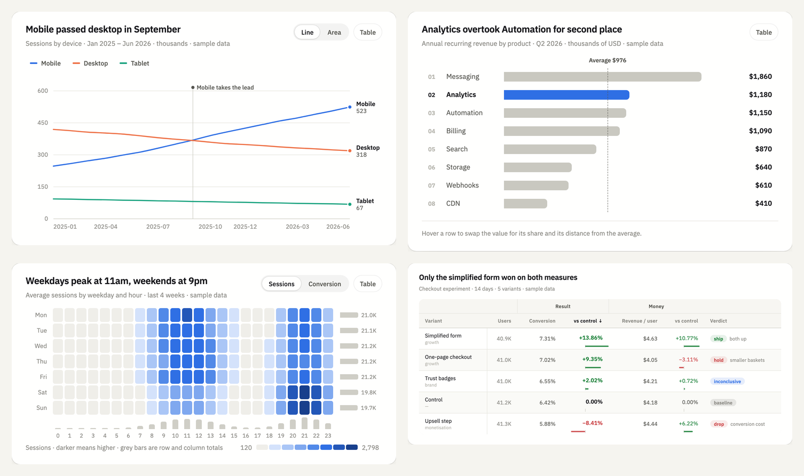

# chart-forge

**让图表说出结论，而不只是把数字画出来。**

`chart-forge` 是一个 [Agent Skill](https://agentskills.io)：把一张表、一份 CSV 或一段查询结果交给 agent，
它先想清楚这张图要说什么，再选出最快能证明这句话的图型，写一份小小的 JSON 规格，渲染成零依赖的交互式
HTML —— 悬停读数、表格视图、深色模式都自带，不需要构建，也不需要图表库。配色在发布前经过色盲与对比度校验，
标题写的是结论，不是指标名。

<picture>
  <source media="(prefers-color-scheme: dark)" srcset="assets/gallery/hero-dark.png">
  
</picture>
<p align="center"><sub>README 里每张图都由本 skill 从 <code>assets/examples/</code> 的规格渲染而来，浅色与深色出自同一个文件。</sub></p>

## 安装

```bash
npx skills add zluckyhou/chart-forge      # Claude Code、Codex、Cursor …
```

或者直接克隆到 agent 读取 skill 的目录：

```bash
git clone https://github.com/zluckyhou/chart-forge ~/.claude/skills/chart-forge
```

渲染 HTML 只需要 Python 3；导出 PNG 另需 `pip install playwright && playwright install chromium`。

## 怎么用

一张图就是一个 JSON 文件。上面第一张折线图的完整规格如下：

```json
{
  "type": "line",
  "title": "Mobile passed desktop in September",
  "subtitle": "Sessions by device · Jan 2025 – Jun 2026 · thousands · sample data",
  "data": {
    "x": ["2025-01", "2025-02", "…", "2026-06"],
    "series": [
      { "name": "Mobile",  "values": [246, 258, "…", 523] },
      { "name": "Desktop", "values": [418, 412, "…", 318] },
      { "name": "Tablet",  "values": [92, 91, "…", 67] }
    ]
  },
  "options": {
    "format": "number",
    "annotations": [{ "x": "2025-09", "label": "Mobile takes the lead" }]
  }
}
```

```bash
python3 scripts/render.py chart.json --validate            # 校验：类型、长度、漏斗单调、OHLC 顺序……
python3 scripts/render.py chart.json -o out/chart.html     # 一个自包含文件
python3 scripts/render.py chart.json -o out/chart.html --png --theme dark
python3 scripts/render.py a.json b.json -o out/report.html # 多张图叠成一页
```

分工是关键：**agent 负责「说什么」，skill 负责「怎么画好」。** agent 写结论、选图型、决定强调谁；
刻度取整、标签避让、命中区、悬停层、表格孪生视图、深色配色和导出都已经处理好，而且每张图都一样。

## 十一种表达

十个 `type`（排名条是 `bar` 加 `horizontal: true`），每种都有可直接运行的样例在
[`assets/examples/`](assets/examples)。

| | |
|---|---|
| **折线 / 面积** —— 末端直接标出系列名和最新值，不用来回找图例；事件标注解释拐点；单调平滑不会过冲。 <br><br><picture><source media="(prefers-color-scheme: dark)" srcset="assets/gallery/line-crossover-dark.png"></picture> | **排名条** —— 自动排序、带序号，只高亮结论对象、其余退灰，一条虚线平均值贯穿所有条。悬停把数值换成占比与相对平均的差距。 <br><br><picture><source media="(prefers-color-scheme: dark)" srcset="assets/gallery/bar-ranking-dark.png"></picture> |
| **柱状** —— 同一份规格可切分组或堆叠；悬停点亮整列光带并列出所有系列；最新一期直接标值。 <br><br><picture><source media="(prefers-color-scheme: dark)" srcset="assets/gallery/bar-grouped-dark.png"></picture> | **漏斗** —— 两步之间的「颈部」形状就是流失，单步转化率写在颈部里，流失最多的一步自动打标。 <br><br><picture><source media="(prefers-color-scheme: dark)" srcset="assets/gallery/funnel-checkout-dark.png"></picture> |
| **热力图** —— 单色由浅到深，右侧与底部的边际条让「最忙的一天、最忙的时段」一眼可见；有符号数据用发散色阶。 <br><br><picture><source media="(prefers-color-scheme: dark)" srcset="assets/gallery/heatmap-hours-dark.png"></picture> | **散点** —— 悬停向两轴投出引线与坐标气泡；头部点自动标注，会重叠时自动跳过；中位线把画面切成四象限。 <br><br><picture><source media="(prefers-color-scheme: dark)" srcset="assets/gallery/scatter-roi-dark.png"></picture> |
| **环形** —— 图例每行自带占比数据条，中心读数跟随指针；占比太接近时一键切成条形比较。 <br><br><picture><source media="(prefers-color-scheme: dark)" srcset="assets/gallery/donut-share-dark.png"></picture> | **数据表** —— 粘性表头与首列、可跨列共享标尺的格内条、标签、二级表头、点击排序。 <br><br><picture><source media="(prefers-color-scheme: dark)" srcset="assets/gallery/table-experiment-dark.png"></picture> |
| **蜡烛图** —— 带股票软件式提示，纵轴按数据范围取景而不锚定零。默认红涨绿跌，`colors: "intl"` 反转。 <br><br><picture><source media="(prefers-color-scheme: dark)" srcset="assets/gallery/candle-price-dark.png"></picture> | **KPI 指标卡** —— 数值、知道「涨是好是坏」的涨跌胶囊，以及按这个判断着色的迷你趋势线。 <br><br><picture><source media="(prefers-color-scheme: dark)" srcset="assets/gallery/kpi-tiles-dark.png"></picture> |

## 为什么比默认图表更好读

- **标题就是结论。**「Analytics 反超 Automation 升到第二」而不是「各产品线 ARR」。指标名、时间范围、
  单位和口径放在副标题一行里。头部只有两行，绝不三行。
- **强调是一等公民。** `highlight` 把一个对象提亮、其余退灰，让一张图只讲一件事，而不是摆出八种颜色却没有论点。
- **直接标注胜过来回查找。** 线的末端、峰值、最新一期、散点的头部会自己标注；其余交给悬停和表格视图。
- **颜色跟随实体，不跟随名次。** 隐藏一个系列，其余颜色不会重新分配。
- **永远没有第二根 Y 轴。** 量级差很远的两个指标，要么两张图，要么统一指数化。
- **每张图都有表格孪生。** 悬停只增强不独占：所有数值都能用键盘读到，也照顾无法悬停的读者。

完整规则与反模式清单见 [`references/rules.md`](references/rules.md)；「该用哪种图」的决策表见
[`references/choosing-a-form.md`](references/choosing-a-form.md)；规格逐字段说明见
[`references/spec.md`](references/spec.md)。

## 配色是算出来的，不是看出来的

[`assets/palette.json`](assets/palette.json) 里的配色带着校验结果：八个分类色、一条顺序色阶、
六级有序色阶和一对发散色，每套都写两遍——浅色底一份、深色底一份——并且由脚本而不是眼睛来判定：

```bash
python3 scripts/validate_palette.py --from-json assets/palette.json
```

相邻色会分别模拟红色盲、绿色盲、蓝黄色盲并在 OKLab 空间量化色差；分类色的**顺序**本身就是安全机制。
换成自己的品牌色，就是改 token、同步到 CSS、再跑校验，直到浅色和深色都通过。

## 语言与主题

界面文案（按钮、表头、提示标签、色阶说明）跟随图表内容的语言：文字里出现中日韩字符就用中文，否则用英文，
可用 `"lang": "zh" | "en"` 强制指定。标题、系列名、类别名永远原样输出。

页面跟随系统主题并带切换按钮；导出时用 `--theme light|dark` 固定。两套配色分别针对各自底色校验——
深色模式是重新挑选的色阶，不是把浅色反相。

## 适用范围与限制

- 刻意做成**一份规格一张图**。仪表盘、筛选条、图表联动不在范围内——需要的话把多张图排在一页上。
- 不是通用绘图引擎。要地图、桑基图、关系图或 3D，请用 [ECharts](https://echarts.apache.org) 或
  [D3](https://d3js.org)；这里覆盖的是分析报告真正会用到的那些图型，并且把它们做好。
- 数据写在规格里，因此不是实时数据组件：数字变了就重新渲染。
- 导出 PNG 需要无头 Chromium；导出 HTML 什么都不需要。
- 默认引用 Google Fonts，内网环境加 `--no-webfont`。

## 赞助

如果它帮你省下了和图表库搏斗的一个下午，可以请我喝杯咖啡：

<a href="https://ko-fi.com/zluckyhou"></a>

## Star 趋势

<a href="https://star-history.com/#zluckyhou/chart-forge&Date">
  <picture>
    <source media="(prefers-color-scheme: dark)" srcset="https://api.star-history.com/svg?repos=zluckyhou/chart-forge&type=Date&theme=dark">
    
  </picture>
</a>

## 许可

[MIT](LICENSE) —— 随便用，包括商用。
